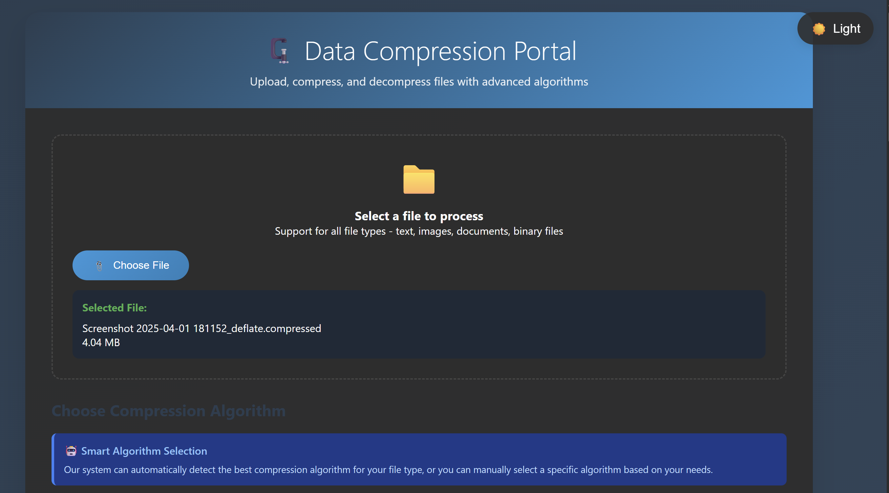

# 🗜️ Data Compression Portal

A modern, web-based compression and decompression portal supporting multiple algorithms, smart auto-detection, and real-time statistics visualization.



> **🎯 Transform your files with intelligent compression algorithms and real-time analytics**

---

## 📌 Project Description

The Data Compression Portal is a full-stack Flask web application that allows users to **compress and decompress files** using a variety of algorithms. It supports intelligent algorithm selection, detailed performance stats (compression ratio, time, size), and a modern animated UI with interactive charts.

Ideal for students, developers, and researchers looking to experiment with real-world data compression techniques.

---

## 🌟 Key Highlights

### 🎯 **Intelligent Algorithm Selection**
- **Auto-Detect Mode**: Our system analyzes your file type and automatically selects the optimal compression algorithm
- **Manual Override**: Choose from 4 specialized algorithms based on your specific needs
- **Smart Recommendations**: Get algorithm suggestions based on file characteristics

### 📈 **Real-time Analytics**
- **Live Processing**: Watch compression happen in real-time with animated progress indicators
- **Detailed Statistics**: View original vs compressed sizes, compression ratios, and processing time
- **Visual Charts**: Interactive pie charts and bar graphs for instant visual feedback
- **Performance Metrics**: Comprehensive analysis of compression efficiency

### 🎨 **Modern User Experience**
- **Dark Mode Support**: Sleek dark interface for comfortable usage
- **Responsive Design**: Works seamlessly across desktop, tablet, and mobile devices
- **Smooth Animations**: Engaging micro-interactions and transitions
- **Intuitive Navigation**: Clean, user-friendly interface design

---

## 🌟 Features
### 💼 Core Functionality
  - **Huffman Coding**
  - **LZ77**
  - **Run-Length Encoding (RLE)**
  - **Deflate (GZIP)**
- ✅ **Auto-Detection** of best algorithm based on file type
- ✅ Detailed compression **stats** (original vs compressed size, time)
- ✅ **Animated charts** for real-time visual feedback
- ✅ **Universal file support**: Text, image, document, binary
- ✅ Works entirely in-browser (no downloads needed)

### 🖼 Supported File Types
- `.txt`, `.html`, `.csv`, `.log`, `.py`
- `.bmp`, `.wav`, `.pcx`
- `.pdf`, `.docx`, `.pptx`, `.xlsx`
- `.exe`, `.bin`, `.zip`, `.rar`, and more

---

## 🧰 Tech Stack Used

| Layer        | Tools                                  |
|--------------|-----------------------------------------|
| **Frontend** | HTML, CSS, JavaScript                   |
| **Backend**  | Python, Flask, flask-cors               |
| **Compression** | Custom Python logic (Huffman, LZ77, RLE, Deflate) |
| **Deployment** | [Render](https://render.com)          |
| **Version Control** | Git + GitHub                     |

---

## 🚀 Deployed Demo

🔗 **Live Site**: [https://comeonpress.onrender.com](https://comeonpress.onrender.com)

---

## 🛠️ Setup Instructions

### ⚙️ Prerequisites
- Python 3.7+
- Git

### 📦 Backend Setup (Flask)
```bash
git clone https://github.com/Anuj-m02/ComeOnPress
cd ComeOnPress
pip install -r requirements.txt
python main.py
```
This will start the Flask backend at: http://localhost:5000

### 🌐 Frontend Setup
Simply open `index.html` in the `templates/` folder via any browser
(Or serve it using a simple server: `python -m http.server`)

---

## 🧪 Usage Guide

### 1. Upload File
Click on **Choose File**, select any file to compress/decompress.

### 2. Select Algorithm
- **Auto**: Let the system detect the best one
- **Manual**: Choose from Huffman, LZ77, RLE, Deflate

### 3. Compress / Decompress
Click on **Compress File** or **Decompress File** and watch real-time processing.

### 4. View Stats & Download
After processing:
- See original vs compressed sizes
- View compression ratio and time
- Download the final file

---

## 📊 Architecture Overview

### 📁 Backend Structure
```
ComeOnPress/
│
├── main.py              # Flask app entry point
├── compression_manager/ # Handles all compression logic
├── templates/
│   └── index.html       # Frontend interface
├── static/              # CSS / JS / image files
├── requirements.txt     # Python dependencies
```

### 🌐 Backend API

**POST /process**

Body (FormData):
```json
{
  "file": <File>,
  "algorithm": "auto" | "huffman" | "lz77" | "rle" | "deflate",
  "operation": "compress" | "decompress"
}
```

Response:
```json
{
  "success": true,
  "original_size": 1200000,
  "processed_size": 600000,
  "compression_ratio": 0.5,
  "filename": "example_deflate.compressed",
  "file_data": [int list]
}
```

---

## 🎨 Application Preview

### 📋 File Upload Interface

*Clean, intuitive file selection with drag-and-drop support and real-time file information display*

### 🧠 Smart Algorithm Selection

*Four powerful compression algorithms with intelligent auto-detection and detailed descriptions*

### 📊 Real-time Processing Results

*Comprehensive statistics with animated charts showing compression performance and visual comparisons*

---

## 📊 Performance Benchmarks

### 🏆 Compression Efficiency by File Type

| File Type | Algorithm Used | Typical Compression | Speed | Use Case |
|-----------|----------------|-------------------|-------|----------|
| 📄 Text Files (`.txt`, `.log`) | Huffman | **40–60%** | ⚡ Fast | Source code, logs |
| 🌐 Web Files (`.html`, `.xml`) | Huffman | **60–80%** | ⚡ Fast | Web pages, configs |
| 🖼️ Bitmap Images (`.bmp`) | RLE | **50–90%** | ⚡⚡ Very Fast | Screenshots, graphics |
| ⚙️ Executables (`.exe`) | LZ77 | **20–40%** | 🐌 Slower | Binary files |
| 📋 Documents (`.pdf`, `.docx`) | Deflate | **30–60%** | ⚡ Fast | Mixed content |

### ⏱️ Processing Speed Benchmarks

| File Size Range | Processing Time | Performance Level |
|-----------------|----------------|-------------------|
| **< 1MB** | ~0.5s | ⚡⚡⚡ Lightning Fast |
| **1-10MB** | ~2-5s | ⚡⚡ Very Fast |
| **10-50MB** | ~5-15s | ⚡ Fast |
| **> 50MB** | ~15-30s | 🔄 Processing... |

### 🎯 Real-world Examples

**Example 1: Source Code Compression**
```
Original: main.py (1.2MB) → Compressed: 450KB
Algorithm: Huffman Coding
Compression Ratio: 62.5%
Processing Time: 0.8s
```

**Example 2: Image Compression**
```
Original: screenshot.bmp (3.4MB) → Compressed: 1.1MB
Algorithm: Run-Length Encoding
Compression Ratio: 67.6%
Processing Time: 1.2s
```

---

## 🧠 Algorithm Deep Dive

### 🤖 **Auto-Detect (Recommended)**


Our intelligent system analyzes your file and automatically selects the best algorithm:
- **Text Files** → Huffman Coding for optimal character frequency compression
- **Images (BMP)** → Run-Length Encoding for solid color areas
- **Binary/Executables** → LZ77 for pattern-based compression
- **General Files** → Deflate (GZIP) for balanced performance

### 🌳 **Huffman Coding**


**Technique**: Variable-length prefix coding based on character frequency
- **Optimal For**: Source code, HTML/XML files, text documents
- **Compression Ratio**: 30-50% size reduction
- **Time Complexity**: O(n log n)
- **Recommended Files**: `.txt`, `.html`, `.xml`, `.json`, `.csv`, `.log`, `.py`, `.js`, `.css`

### 🔄 **LZ77**


**Technique**: Dictionary-based sliding window compression
- **Optimal For**: Executables, binary files, images with repetitive patterns
- **Compression Ratio**: 40-70% size reduction
- **Time Complexity**: O(n²) worst case
- **Recommended Files**: `.exe`, `.dll`, `.bin`, `.bmp`, `.wav`, `.rar`, `.zip`

### 🎨 **Run-Length Encoding (RLE)**


**Technique**: Replaces sequences of identical data with count and value
- **Optimal For**: Images with large solid areas, simple graphics
- **Compression Ratio**: 50-95% (highly variable based on content)
- **Time Complexity**: O(n)
- **Recommended Files**: `.bmp`, `.pcx`, `.tga`, `.ppm`, monochrome images

### ⚡ **Deflate (GZIP)**


**Technique**: Combines LZ77 and Huffman coding for optimal compression
- **Optimal For**: Mixed content, general-purpose compression
- **Compression Ratio**: 50-80% size reduction
- **Time Complexity**: O(n log n)
- **Recommended Files**: `.pdf`, `.doc`, `.docx`, `.ppt`, `.xlsx`, mixed data

---

## 🔐 Security Features
- File-type validation
- File size limits
- CORS enabled via flask-cors
- Exception handling and response sanitization

---

## 🧩 Future Enhancements
- [ ] Add LZMA, Brotli, Zstandard
- [ ] Support drag & drop upload
- [ ] Batch file compression
- [ ] Add analytics dashboard
- [ ] Progressive Web App (PWA) support
- [ ] File type-specific optimization rules

---

## 🐛 Troubleshooting

| Problem | Fix |
|---------|-----|
| File not uploading | Check browser permissions or file size |
| Compression fails | File may already be compressed or corrupted |
| Download not working | Check browser download settings or CORS issues |

---

## 🤝 Contributing

1. Fork the repo
2. Create your feature branch: `git checkout -b feature/amazing-feature`
3. Commit your changes: `git commit -m 'Add amazing feature'`
4. Push to the branch: `git push origin feature/amazing-feature`
5. Open a Pull Request

---

## 👤 About the Developer

<div align="center">


**🎓 Anuj Singh**  
*B.Tech Student @ IIT Roorkee*

[](https://github.com/Anuj-m02)
[](https://linkedin.com/in/anuj-singh-dev)

**🚀 Expertise**: Data Structures & Algorithms • Python Development • AI/ML • Full-Stack Web Development

**💡 Passion**: Building innovative solutions that solve real-world problems through efficient algorithms and modern web technologies

</div>

---

---

## 📄 License

This project is licensed under the MIT License - see the [LICENSE](LICENSE) file for details.

---

<div align="center">

**Made with ❤️ by [Anuj Singh](https://github.com/Anuj-m02)**

[](https://github.com/Anuj-m02/ComeOnPress)
[](https://github.com/Anuj-m02/ComeOnPress/fork)

*⭐ If this project helped you, please consider giving it a star!*

</div>

---

### 🎯 Pro Tips for Best Results:

1. **📁 File Selection**: Choose the right file type for optimal compression ratios
2. **🤖 Use Auto-Detect**: Let our AI choose the best algorithm for maximum efficiency  
3. **📊 Monitor Stats**: Keep an eye on compression ratios to understand algorithm performance
4. **🔄 Experiment**: Try different algorithms to see which works best for your specific use case

**Ready to compress? Visit our [live demo](https://comeonpress.onrender.com) and start optimizing your files today! 🚀**
